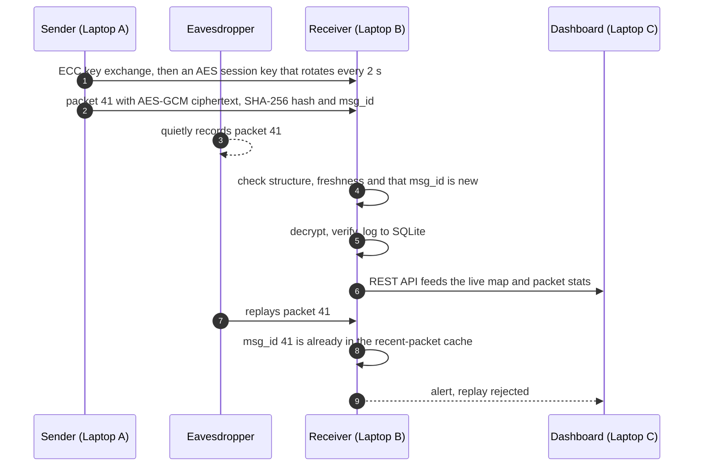

 

Third-year CSE student at Chennai Institute of Technology, India.

Most of what I've built turned out to be about one problem: a system that looks fine while it's wrong. A seafarer's health band that said "all safe" because two of its three alarms could never fire. Drone telemetry that was encrypted and could still be replayed. Those are the bugs I like hunting.

 

## Case file 01 · the sensor that read zero

An ESP32 band for seafarers (ECG, motion, water contact, RFID crew ID) showed nothing useful for months, and the WiFi got the blame. The logs told a different story.

The rewrite measures a real heart rate instead of sending one random ECG sample every 30 seconds:

 

## Case file 02 · the packet that came back

AirLock, runner-up at HackSymmetric, protects drone-to-base telemetry. Encryption stops people from reading a packet. It doesn't stop them from recording one and sending it again. So every packet carries a unique ID, and the receiver remembers what it has already seen.

<b>The same flow as a sequence diagram</b>

 

 

## Field notes

Things that each cost me an evening, so they don't have to cost you one.

| What bit me | What I do now |
|---|---|
| `analogRead(pin) / 4` on the ESP32's 12-bit ADC floored small signals to exactly 0 | Keep the raw 0 to 4095 counts and scale later |
| ADC2 pins (GPIO 0, 2, 4, 12-15, 25-27) stop reading analog values while WiFi is on | Analog sensors go on ADC1 (GPIO 32-39) |
| The RFID reader shared UART0 with the USB console, so crew IDs came through as 0 | Give it its own UART (Serial2 on GPIO 16/17) |
| The EM-18's TX line idles at 5 V and GPIO16 isn't 5 V tolerant | A 1k / 2k divider on that line |
| Calling `WiFi.begin()` inside the retry loop kept aborting the connection it had started | Call it once per attempt, then wait |
| An alarm rule that can never fire looks exactly like "everything is safe" | Replay every rule over the whole recorded history |
| Encryption alone doesn't stop someone resending a valid packet | Unique message IDs and a recent-packet cache |
| The free ThingSpeak tier drops writes that come less than 15 s apart | Upload every 30 s |

 

## Toolbox

  

 

## The contribution graph, eaten

<picture>
  <source media="(prefers-color-scheme: dark)" srcset="https://raw.githubusercontent.com/z33shxn/z33shxn/output/snake-dark.svg">
  <source media="(prefers-color-scheme: light)" srcset="https://raw.githubusercontent.com/z33shxn/z33shxn/output/snake.svg">
  
</picture>

