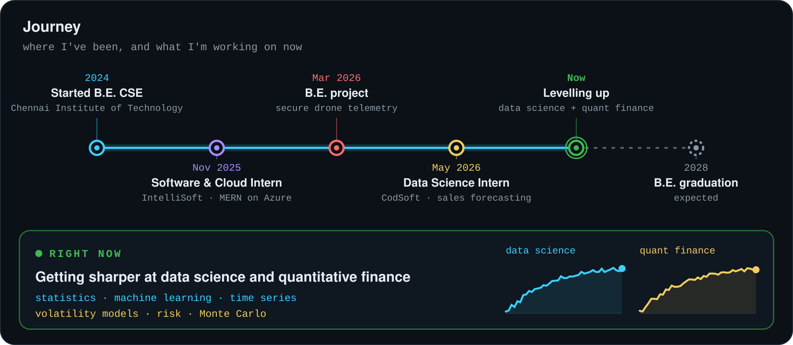

 

I'm a Computer Science undergraduate at Chennai Institute of Technology, focused on quantitative finance and data science. I like building complete systems and letting the evidence decide what ships.

Most of my time goes into machine learning and statistics, secure backends and AI automation. Through my venture, Zeequence, I build AI lead-conversion systems for solar businesses.

**Interests:** quantitative finance, research, data science, artificial intelligence, machine learning

 

## How I work

A strong in-sample result is where the work starts, not where it ends. Out-of-sample tests, realistic costs and robustness checks come first, and most ideas don't survive them. That's the point.

 

## Skills

 

## Journey

 

## Always learning

 

## Beyond code

 

## Toolbox

  

 

## The contribution graph, eaten

<picture>
  <source media="(prefers-color-scheme: dark)" srcset="https://raw.githubusercontent.com/z33shxn/z33shxn/output/snake-dark.svg">
  <source media="(prefers-color-scheme: light)" srcset="https://raw.githubusercontent.com/z33shxn/z33shxn/output/snake.svg">
  
</picture>

